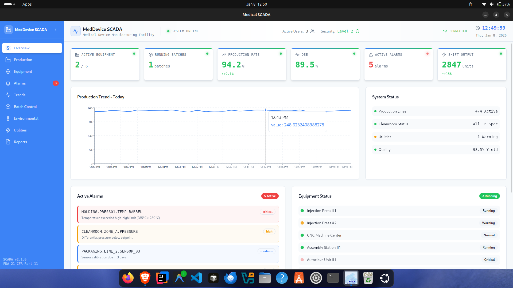
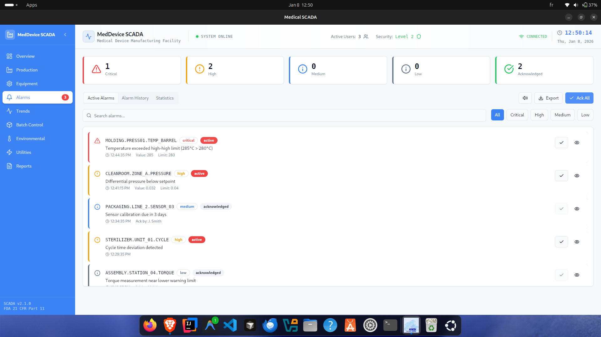
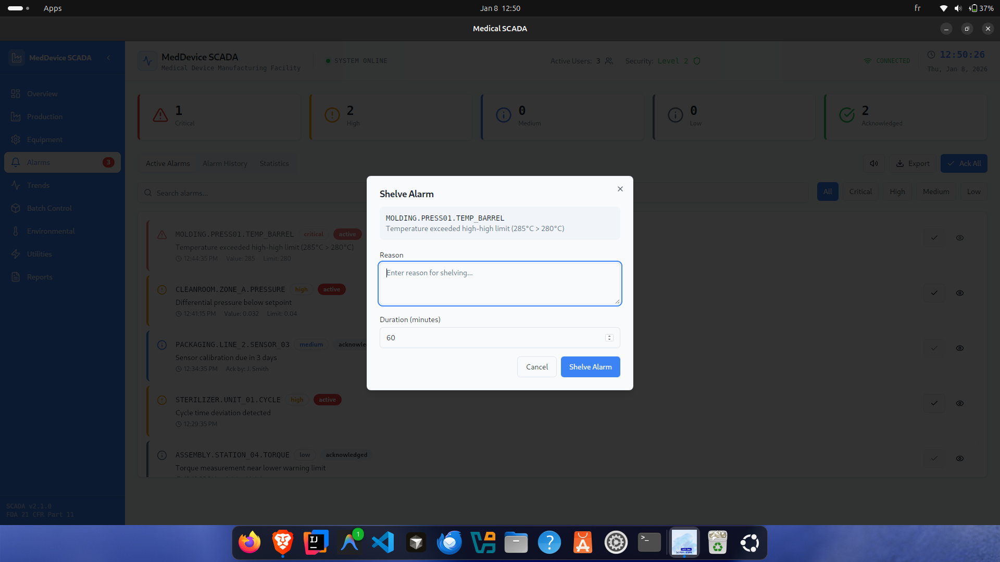
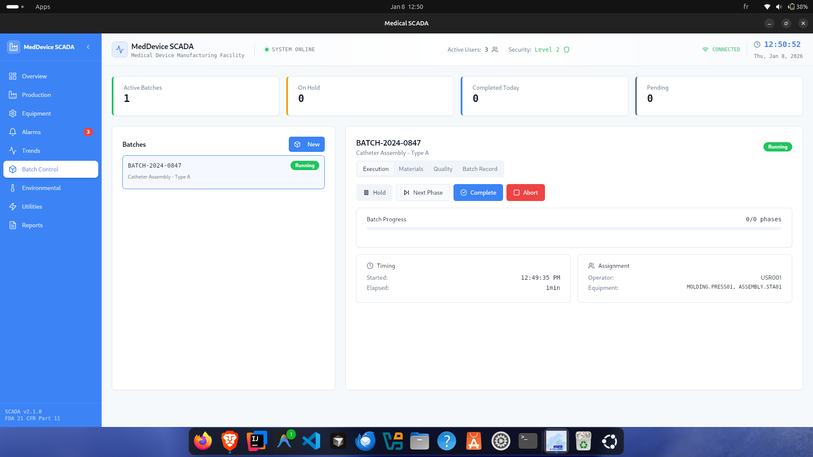

<div align="center">

# 🏥 Medical SCADA System

### Enterprise Supervisory Control & Data Acquisition for Medical Device Manufacturing

<p>
  
  
  
  
  
</p>

A comprehensive SCADA system designed specifically for medical device manufacturing environments. Monitor and control equipment, manage production batches, track alarms, and visualize production trends in real-time with enterprise-grade security and reliability.

[Features](#-features) • [Installation](#-installation) • [Usage](#️-usage) • [Architecture](#-architecture) • [Contributing](#-contributing)


</div>

---

## ✨ Features

### 📊 Real-Time Monitoring & Control

**Comprehensive Equipment Supervision:**
- **Molding Presses**: Real-time pressure, temperature, and cycle monitoring
- **CNC Machines**: Position tracking, spindle speed, and tool wear
- **Assembly Stations**: Workstation status, throughput, and quality metrics
- **Environmental Controls**: Cleanroom conditions, HVAC systems
- **Utility Systems**: Compressed air, water, power consumption

**Live Data Visualization:**
- Interactive HMI (Human-Machine Interface) screens
- Customizable dashboards for different production areas
- Real-time KPI displays and performance metrics
- Equipment status indicators with color-coded states

### 🚨 Advanced Alarm Management

**Intelligent Alerting System:**
- **Priority Levels**: Critical, High, Medium, Low classification
- **Alarm States**: Active, Acknowledged, Shelved, Cleared
- **Smart Filtering**: Filter by priority, equipment, time range
- **Acknowledgment Tracking**: Operator accountability with timestamps
- **Alarm Shelving**: Temporary suppression for maintenance periods
- **Escalation Logic**: Automatic notification for unacknowledged critical alarms
- **Audio/Visual Alerts**: Multi-level notification system

**Alarm Analytics:**
- Historical alarm reports
- Frequency analysis
- Root cause investigation tools
- Alarm flooding detection

### 📦 Batch Management & Traceability

**Production Batch Control:**
- **Recipe Management**: Store and execute production recipes
- **Product Code Tracking**: Link batches to specific product SKUs
- **Equipment Assignment**: Track which machines produced each batch
- **Material Traceability**: Raw material lot tracking
- **Quality Integration**: Link test results to batch records
- **Batch Genealogy**: Complete production history

**Batch Features:**
- Start/stop batch control
- Real-time batch progress monitoring
- Electronic batch records (EBR)
- 21 CFR Part 11 compliance ready

### 🔧 Equipment Management

**Comprehensive Asset Tracking:**
- **Real-Time Status**: Running, idle, fault, maintenance states
- **Calibration Management**: Schedule and track calibration due dates
- **Preventive Maintenance**: Automated PM scheduling and tracking
- **Equipment History**: Complete service and maintenance logs
- **Performance Metrics**: OEE (Overall Equipment Effectiveness)
- **Spare Parts Tracking**: Inventory management for critical components

**Maintenance Features:**
- Work order generation
- Downtime analysis
- MTBF/MTTR calculations
- Service history reports

### 📈 Trend Analysis & Reporting

**Advanced Data Analytics:**
- **Historical Trends**: Interactive time-series charts
- **Real-Time Trends**: Live data streaming with auto-refresh
- **Multi-Variable Plotting**: Compare multiple parameters simultaneously
- **Zoom & Pan**: Detailed investigation of specific time periods
- **Data Export**: CSV, Excel, PDF report generation
- **Statistical Analysis**: Min, max, average, standard deviation

**Visualization Tools:**
- Line charts, bar graphs, scatter plots
- Heatmaps for pattern recognition
- Pareto charts for quality analysis
- Control charts (SPC)

### 📝 Audit Trail & Compliance

**Complete Traceability:**
- **Operator Actions**: Every user interaction logged
- **System Events**: Equipment state changes, alarms, batch operations
- **Data Changes**: Before/after values with timestamps
- **User Authentication**: Role-based access control (RBAC)
- **Digital Signatures**: Secure approval workflows
- **Tamper-Proof Logs**: Cryptographic integrity verification

**Compliance Features:**
- FDA 21 CFR Part 11 ready
- EU GMP Annex 11 compliant
- ISO 13485 support
- GAMP 5 aligned

---

## 🛠️ Technology Stack

<div align="center">

### Core Technologies

<p>
  
  
  
  
  
  
</p>

</div>

| Layer | Technology | Purpose |
|-------|-----------|---------|
| **Frontend Framework** | React 18 + TypeScript | Modern UI with type safety |
| **Build Tool** | Vite | Lightning-fast development & builds |
| **UI Framework** | shadcn/ui + Tailwind CSS | Professional, accessible components |
| **Desktop Runtime** | Tauri (Rust) | Secure, lightweight native wrapper |
| **Package Manager** | Bun / npm | Fast dependency management |
| **Charts & Graphs** | Recharts / D3.js | Advanced data visualization |
| **State Management** | React Hooks + Context | Efficient state handling |
| **Type System** | TypeScript 5+ | Full type coverage & safety |

---

## 📸 Interface Preview

<div align="center">
  <table style="width:100%">
    <tr>
      <td width="50%"><br/><b>Dashboard Overview</b></td>
      <td width="50%"><br/><b>Real-time Monitoring</b></td>
    </tr>
    <tr>
      <td width="50%"><br/><b>Alarm Management</b></td>
      <td width="50%"><br/><b>Trend Analysis</b></td>
    </tr>
  </table>
</div>

---


## 🚀 Getting Started

### Prerequisites

Ensure you have the following installed on your development machine:

- **Node.js** (v18 or higher) - [Download](https://nodejs.org/)
- **Bun** (v1.0+) - [Download](https://bun.sh/) (optional, faster alternative to npm)
- **Rust** (latest stable) - [Install](https://rustup.rs/)
  ```bash
  curl --proto '=https' --tlsv1.2 -sSf https://sh.rustup.rs | sh
  ```
- **Tauri Prerequisites** (Linux):
  ```bash
  # Ubuntu/Debian
  sudo apt install libwebkit2gtk-4.0-dev build-essential curl wget libssl-dev libgtk-3-dev libayatana-appindicator3-dev librsvg2-dev
  ```

### Installation

1. **Clone the Repository**

   ```bash
   git clone https://github.com/youssef-ben-letaifa/medical-scada.git
   cd medical-scada
   ```

2. **Install Dependencies**

   Using Bun (recommended for speed):
   ```bash
   bun install
   ```

   Or using npm:
   ```bash
   npm install
   ```

3. **Verify Installation**

   Check that all tools are properly installed:
   ```bash
   node --version    # Should be v18+
   bun --version     # If using Bun
   rustc --version   # Should show stable version
   ```

---

## 🖥️ Usage

### Development Mode

Start the application with hot-reload for development:

**Using Bun:**
```bash
bun tauri dev
```

**Using npm:**
```bash
npm run tauri dev
```

This will:
1. Start the Vite development server on `http://localhost:5173`
2. Launch the Tauri desktop window
3. Enable hot module replacement (HMR) for instant updates

### Production Build

Build the application for distribution:

**Using Bun:**
```bash
bun tauri build
```

**Using npm:**
```bash
npm run tauri build
```

Build artifacts will be located in:
- **Linux**: `src-tauri/target/release/bundle/deb/`
- **Windows**: `src-tauri/target/release/bundle/msi/`
- **macOS**: `src-tauri/target/release/bundle/dmg/`

### Available Scripts

| Command | Description |
|---------|-------------|
| `bun dev` / `npm run dev` | Start Vite dev server only |
| `bun tauri dev` | Start Tauri development mode |
| `bun tauri build` | Build production desktop app |
| `bun build` / `npm run build` | Build web assets only |
| `bun lint` / `npm run lint` | Run ESLint checks |
| `bun test` / `npm test` | Run test suite |

---

## 📂 Project Structure

```
medical-scada/
│
├── index.html                    # Vite HTML entry point
├── package.json                  # npm/bun dependencies & scripts
├── tsconfig.json                 # TypeScript configuration
├── vite.config.ts               # Vite build configuration
├── tailwind.config.ts           # Tailwind CSS settings
├── eslint.config.js             # ESLint rules
│
├── public/                       # Static assets
│   ├── icons/
│   └── images/
│
├── src/                          # Frontend source code
│   ├── main.tsx                  # React entry point
│   ├── App.tsx                   # Root component
│   ├── index.css                 # Global styles
│   │
│   ├── components/               # Reusable UI components
│   │   ├── scada/                # SCADA-specific components
│   │   │   ├── AlarmPanel.tsx    # Alarm management interface
│   │   │   ├── BatchControl.tsx  # Batch management
│   │   │   ├── EquipmentGrid.tsx # Equipment status overview
│   │   │   ├── TrendViewer.tsx   # Historical trend charts
│   │   │   └── HMIScreen.tsx     # HMI display component
│   │   │
│   │   ├── charts/               # Chart components
│   │   │   ├── LineChart.tsx
│   │   │   ├── BarChart.tsx
│   │   │   └── RealTimeTrend.tsx
│   │   │
│   │   ├── widgets/              # Dashboard widgets
│   │   │   ├── KPICard.tsx
│   │   │   ├── StatusIndicator.tsx
│   │   │   └── GaugeWidget.tsx
│   │   │
│   │   └── ui/                   # shadcn/ui components
│   │       ├── button.tsx
│   │       ├── card.tsx
│   │       ├── dialog.tsx
│   │       └── ... (more components)
│   │
│   ├── pages/                    # Application routes
│   │   ├── Dashboard.tsx         # Main SCADA dashboard
│   │   ├── AlarmHistory.tsx      # Alarm logs & analysis
│   │   ├── BatchManagement.tsx   # Batch control interface
│   │   ├── EquipmentStatus.tsx   # Equipment overview
│   │   ├── TrendAnalysis.tsx     # Historical trends
│   │   └── Settings.tsx          # System configuration
│   │
│   ├── hooks/                    # Custom React hooks
│   │   ├── useAlarms.ts          # Alarm state management
│   │   ├── useBatches.ts         # Batch operations
│   │   ├── useEquipment.ts       # Equipment data
│   │   └── useTrends.ts          # Trend data fetching
│   │
│   ├── types/                    # TypeScript type definitions
│   │   ├── alarm.types.ts        # Alarm interfaces
│   │   ├── batch.types.ts        # Batch interfaces
│   │   ├── equipment.types.ts    # Equipment interfaces
│   │   └── trend.types.ts        # Trend data types
│   │
│   ├── services/                 # API & business logic
│   │   ├── api.ts                # API client
│   │   ├── alarmService.ts       # Alarm operations
│   │   ├── batchService.ts       # Batch operations
│   │   └── equipmentService.ts   # Equipment operations
│   │
│   ├── utils/                    # Utility functions
│   │   ├── formatters.ts         # Data formatting
│   │   ├── validators.ts         # Input validation
│   │   └── constants.ts          # Application constants
│   │
│   └── lib/                      # Library code
│       └── utils.ts              # Helper functions
│
└── src-tauri/                    # Tauri (Rust) backend
    ├── tauri.conf.json           # Tauri configuration
    ├── Cargo.toml                # Rust dependencies
    ├── build.rs                  # Build script
    │
    ├── src/                      # Rust source code
    │   ├── main.rs               # Application entry
    │   └── lib.rs                # Library functions
    │
    ├── icons/                    # Application icons
    │
    └── capabilities/             # Tauri capabilities
        └── default.json
```

---

## 🏗️ Architecture & Design

### System Architecture

```
┌─────────────────────────────────────────────────────────────┐
│                   Operator Interface (React)                │
│  ┌──────────────┐  ┌──────────────┐  ┌──────────────┐       │
│  │  Dashboard   │  │    Alarms    │  │    Batch     │       │
│  │   Screens    │  │  Management  │  │   Control    │       │
│  └──────────────┘  └──────────────┘  └──────────────┘       │
└───────────────────────┬─────────────────────────────────────┘
                        │
┌───────────────────────▼─────────────────────────────────────┐
│              Application State Layer (Hooks)                │
│  ┌──────────┐  ┌──────────┐  ┌──────────┐  ┌──────────┐     │
│  │  Alarms  │  │ Batches  │  │Equipment │  │  Trends  │     │
│  └──────────┘  └──────────┘  └──────────┘  └──────────┘     │
└───────────────────────┬─────────────────────────────────────┘
                        │
┌───────────────────────▼─────────────────────────────────────┐
│                 Business Logic (Services)                   │
│  • Data Validation         • State Updates                  │
│  • API Communication       • Event Handling                 │
└───────────────────────┬─────────────────────────────────────┘
                        │
┌───────────────────────▼─────────────────────────────────────┐
│              Tauri IPC Bridge (Rust Backend)                │
│  • Secure Communication     • System Access                 │
│  • File Operations          • Hardware Integration          │
└───────────────────────┬─────────────────────────────────────┘
                        │
┌───────────────────────▼─────────────────────────────────────┐
│                    External Systems                         │
│  ┌───────────┐  ┌───────────┐  ┌───────────┐                │
│  │    PLC    │  │    MES    │  │  Database │                │
│  │  Systems  │  │  System   │  │  Server   │                │
│  └───────────┘  └───────────┘  └───────────┘                │
└─────────────────────────────────────────────────────────────┘
```

### Key Design Principles

1. **Separation of Concerns**: Clear separation between UI, business logic, and data layers
2. **Type Safety**: Full TypeScript coverage to catch errors at compile time
3. **Component Reusability**: Modular components for easy maintenance
4. **Performance**: Optimized rendering and efficient state management
5. **Security**: Rust-based backend with secure IPC communication
6. **Scalability**: Architecture supports multiple production lines

### Data Flow

1. **Equipment Data** → PLC/Controllers → Tauri Backend → React Hooks → UI Components
2. **User Actions** → React Components → Service Layer → Tauri Backend → Equipment
3. **Alarms** → Real-time event stream → Alarm Service → Alarm Panel → Operator
4. **Batches** → MES Integration → Batch Service → Batch Control Interface

---

## 🔌 Integration Guide

### Connecting to PLCs

The system supports various industrial protocols:

- **Modbus TCP/RTU**: Most common industrial protocol
- **OPC UA**: Modern, secure communication
- **EtherNet/IP**: Allen-Bradley controllers
- **PROFINET**: Siemens equipment

Example integration (add to `src/services/plcService.ts`):

```typescript
import { ModbusClient } from '@modbus/client';

export const connectToPLC = async (ip: string, port: number) => {
  const client = new ModbusClient();
  await client.connect(ip, port);
  return client;
};
```

### MES Integration

Connect to Manufacturing Execution Systems:

```typescript
// src/services/mesService.ts
export const fetchBatchRecipe = async (productCode: string) => {
  const response = await fetch(`/api/mes/recipes/${productCode}`);
  return await response.json();
};
```

---

## 🔒 Security Features

- **Role-Based Access Control (RBAC)**: Different permissions for operators, supervisors, engineers
- **Audit Trail**: Complete logging of all user actions
- **Secure Communication**: TLS/SSL encryption for network traffic
- **Data Integrity**: Cryptographic signatures for critical records
- **Session Management**: Automatic timeout and re-authentication
- **Rust Backend**: Memory-safe, secure desktop application

---

## 🐛 Troubleshooting

### Common Issues

**Tauri build fails:**
```bash
# Update Rust
rustup update

# Check version
rustc --version
```

**Port already in use:**
```bash
# Change port in vite.config.ts
export default defineConfig({
  server: { port: 5174 }
});
```

**WebView2 missing (Windows):**
- Download and install [WebView2 Runtime](https://developer.microsoft.com/en-us/microsoft-edge/webview2/)

**Permission denied (Linux):**
```bash
# Add user to dialout group for serial access
sudo usermod -a -G dialout $USER
```

---

## 🤝 Contributing

We welcome contributions from the community! Here's how to get involved:

### How to Contribute

1. **Fork the Repository**
   ```bash
   git clone https://github.com/youssef-ben-letaifa/medical-scada.git
   ```

2. **Create Feature Branch**
   ```bash
   git checkout -b feature/new-scada-feature
   ```

3. **Make Changes**
   - Follow TypeScript best practices
   - Maintain type safety
   - Add comments for complex logic
   - Update documentation

4. **Test Thoroughly**
   ```bash
   bun test
   bun lint
   ```

5. **Commit & Push**
   ```bash
   git commit -m "Add: New SCADA feature"
   git push origin feature/new-scada-feature
   ```

6. **Create Pull Request**

### Development Guidelines

- **Code Style**: Follow ESLint configuration
- **Types**: Maintain full TypeScript coverage
- **Components**: Keep them focused and reusable
- **Testing**: Add unit tests for new features
- **Documentation**: Update README for significant changes

---

## 🎯 Roadmap

- [x] Real-time equipment monitoring
- [x] Advanced alarm management
- [x] Batch control system
- [x] Trend visualization
- [x] Audit trail & logging
- [ ] OPC UA server integration
- [ ] Advanced analytics & ML predictions
- [ ] Mobile companion app
- [ ] Cloud data synchronization
- [ ] Recipe versioning system
- [ ] Digital twin integration
- [ ] Automated reporting engine
- [ ] Multi-site management
- [ ] AR maintenance guidance

---

## 📄 License

MIT License

Copyright (c) 2026 Youssef BEN LETAIFA

Permission is hereby granted, free of charge, to any person obtaining a copy
of this software and associated documentation files (the "Software"), to deal
in the Software without restriction, including without limitation the rights
to use, copy, modify, merge, publish, distribute, sublicense, and/or sell
copies of the Software, and to permit persons to whom the Software is
furnished to do so, subject to the following conditions:

The above copyright notice and this permission notice shall be included in all
copies or substantial portions of the Software.

THE SOFTWARE IS PROVIDED "AS IS", WITHOUT WARRANTY OF ANY KIND, EXPRESS OR
IMPLIED, INCLUDING BUT NOT LIMITED TO THE WARRANTIES OF MERCHANTABILITY,
FITNESS FOR A PARTICULAR PURPOSE AND NONINFRINGEMENT. IN NO EVENT SHALL THE
AUTHORS OR COPYRIGHT HOLDERS BE LIABLE FOR ANY CLAIM, DAMAGES OR OTHER
LIABILITY, WHETHER IN AN ACTION OF CONTRACT, TORT OR OTHERWISE, ARISING FROM,
OUT OF OR IN CONNECTION WITH THE SOFTWARE OR THE USE OR OTHER DEALINGS IN THE
SOFTWARE.

---

## 👨‍💻 Author

**Youssef BEN LETAIFA**

- GitHub: [@youssef-ben-letaifa](https://github.com/youssef-ben-letaifa)
- LinkedIn: [Youssef Ben Letaifa](https://www.linkedin.com/in/youssefbenletaifa/)
- Portfolio: [youssef-ben-letaifa.github.io](https://youssef-ben-letaifa.github.io/ben.letaifa.youssef/)

---


## ⚠️ Compliance & Validation

This SCADA system is designed to support compliance with:

- **FDA 21 CFR Part 11**: Electronic records and signatures
- **EU GMP Annex 11**: Computerized systems
- **ISO 13485**: Medical device quality management
- **GAMP 5**: Good Automated Manufacturing Practice

**Note**: This software requires validation and qualification before use in regulated production environments. Consult with your quality assurance team for proper implementation.

---

<div align="center">

### 🏥 Professional SCADA for Medical Device Manufacturing

**Built with 💙 for the Medical Manufacturing Industry**


**Version 1.0** | Last Updated: January 2026

</div>
